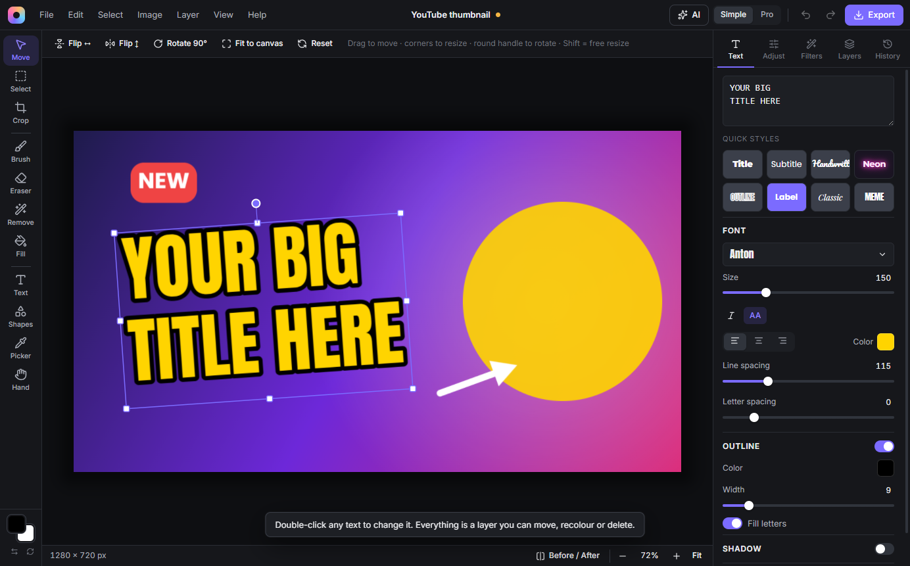
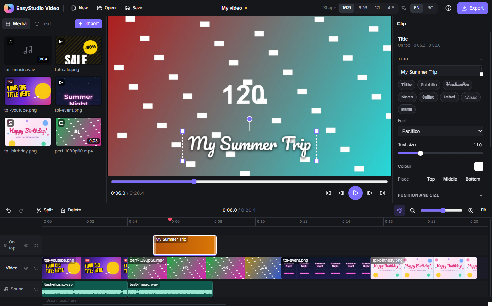
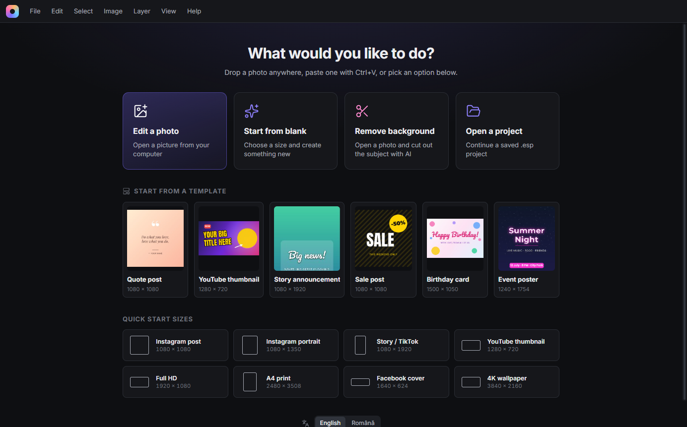
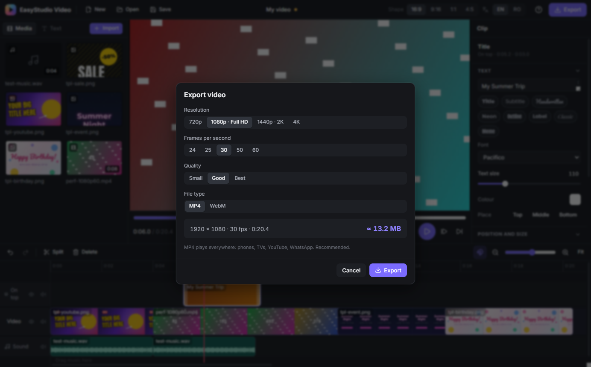

# EasyStudio

**Two easy desktop apps for Windows — a photo editor and a video editor — where every pixel is processed on the graphics card.**

The idea: the power of Photoshop and Premiere, with the simplicity of Canva and CapCut, for people who have never edited a photo or a video before. English and Romanian.

<p align="center">
  
  
</p>

## Download

Windows 10 / 11 installers are on the [**Releases**](../../releases) page:

- `EasyStudio-Photo-Setup-1.0.0.exe`
- `EasyStudio-Video-Setup-1.0.0.exe`

> The installers are not code-signed yet, so Windows SmartScreen may say *"Windows protected your PC"*. Click **More info → Run anyway**. The SHA-256 checksums of both files are listed on the release page. Microsoft Store versions, which install without that warning, are being prepared ([how](docs/STORE.ro.md)).

The apps collect no personal data. See the [privacy policy](PRIVACY.md).

## EasyStudio Photo



- **Easy by default.** A *Simple* mode shows only the essentials, while *Pro* adds blend modes, masks and the clone stamp. Tools have names, not only icons, and the tool bar only shows options for the current tool.
- **GPU editing.**
  - Adjustments and 12 one-click filters, all non-destructive, rendered with WebGL2 shaders.
  - Measured on a 96 MP photo: 7 ms per frame while dragging a slider.
- **Layers:**
  - pictures, editable text (13 bundled fonts plus the system's, 8 quick styles) and shapes;
  - 16 blend modes and layer masks.
- **Painting and selections:**
  - brush, eraser, clone stamp, fill and gradient;
  - rectangle / ellipse / lasso / magic-wand selections.
- **Local AI (free, private, offline, WebGPU):**

  | Feature | Model |
  |---|---|
  | Remove background, select subject | IS-Net |
  | Select an object with one click | MobileSAM |
  | Erase objects | LaMa |
  | Enlarge 2× / 4× | Real-ESRGAN |

- **Optional AI assistant.** Type what you want (*"make it warmer and crop it for Instagram"*). It works with Ollama (local), Claude, ChatGPT or Gemini, using your own API key, encrypted with Windows DPAPI. Changes are previewed live and applied as one undo step.
- **Files:**
  - Photoshop (PSD) import with layers, masks and blend modes;
  - `.esp` projects, recent files, autosave with crash recovery;
  - 6 ready-made templates;
  - export to JPG / PNG / WebP with a file-size estimate.

## EasyStudio Video



- **Timeline like CapCut:**
  - a *magnetic* main track, so there are no gaps and clips reorder by dragging;
  - free tracks for overlays, titles and music;
  - split (`S`), trim, snapping, film strips and waveforms, unlimited undo.
- **Every clip:**
  - move, resize and rotate right in the player;
  - speed 0.25×–4×, volume, fades;
  - the photo app's colour filters;
  - transitions: dissolve, through black, slide, zoom.
- **Titles** with the same fonts and styles as the photo editor.
- **Frame shapes:** 16:9, 9:16, 1:1, 4:5.
- **Hardware-accelerated.** Decoding and encoding go through WebCodecs on the GPU:
  - playback on a GTX 1650: 1080p 60 fps shows every frame, 4K 30 fps drops only a few frames while the decoder starts;
  - export to MP4 (H.264 + AAC) or WebM (VP9 + Opus), from 720p to 4K;
  - 1080p exports run about 3× faster than real time;
  - the file is streamed to disk while it is made, so long videos do not fill the memory.
- **Projects:** `.esv` files, recent projects, autosave every 30 s with crash recovery, first-run tips.

## How it works

| | |
|---|---|
| App | Electron 44, React 19, TypeScript, Vite, zustand, i18next |
| Pictures | A custom WebGL2 compositor (`packages/gpu`) shared by both apps: effects, blend modes, masks and painting run as shaders. Images are stored as tiles, so undo only keeps the changed 256×256 tiles. |
| Local AI | ONNX Runtime Web with the WebGPU execution provider, in a Web Worker. It falls back to the CPU and restarts the worker if memory runs out. |
| Video | [Mediabunny](https://mediabunny.dev) on top of WebCodecs. Files are read in byte ranges through IPC. Playback is driven by the AudioContext clock, and the preview and the export share the same compositor. |
| Tests | Vitest for the pure logic (timeline, history, geometry, translations). The apps also have a `--selftest` mode that drives the real UI in Electron and checks pixels, frame numbers, audio and exported files. |

```
packages/core   undo history, layer geometry, presets
packages/gpu    WebGL2 renderer: effects, filters, blend modes, painting
packages/ui     theme and shared React components, i18n
packages/draw   text rendering, text styles, bundled fonts (shared by both apps)
apps/photo      EasyStudio Photo
apps/video      EasyStudio Video
tools/          test and helper scripts
docs/           plans and developer notes (Romanian)
```

## Build from source

Requires Windows, Node.js 22+ and Git.

```powershell
. .\env.ps1                         # keeps npm / Electron caches inside the project folder
npm install
node node_modules\electron\install.js
npm run photo:dev                   # or: npm run video:dev
npm test                            # unit tests
npm run photo:dist                  # installer in dist\photo  (video:dist → dist\video)
npm run photo:store                 # Microsoft Store package (.appx), see docs/STORE.ro.md
```

Developer notes, performance numbers and the self-test commands are in [`docs/DEVELOPMENT.ro.md`](docs/DEVELOPMENT.ro.md) (Romanian).

## Pe scurt, în română

EasyStudio are două aplicații desktop pentru Windows:

- un **editor foto** ușor, cu straturi, text, filtre, AI local gratuit (scoate fundalul, șterge obiecte, mărește poze) și import PSD;
- un **editor video** ușor, ca CapCut: tai clipuri, pui titluri, muzică, filtre și tranziții, exporți MP4 până la 4K.

Toată munca pe imagine se face pe placa video. Interfața e în română și engleză.

## License

© 2026 bucuriftimi-debug. **All rights reserved.** The source code is published so that it can be read. You may not copy, modify or redistribute it without permission. See [LICENSE](LICENSE).

Third-party parts keep their own licenses:

- Mediabunny (MPL-2.0), ONNX Runtime (MIT), ag-psd (MIT), React (MIT), Electron (MIT);
- bundled fonts (SIL Open Font License);
- AI models (downloaded on first use): IS-Net and LaMa (Apache-2.0), MobileSAM (Apache-2.0 / MIT), Real-ESRGAN (BSD-3-Clause).
